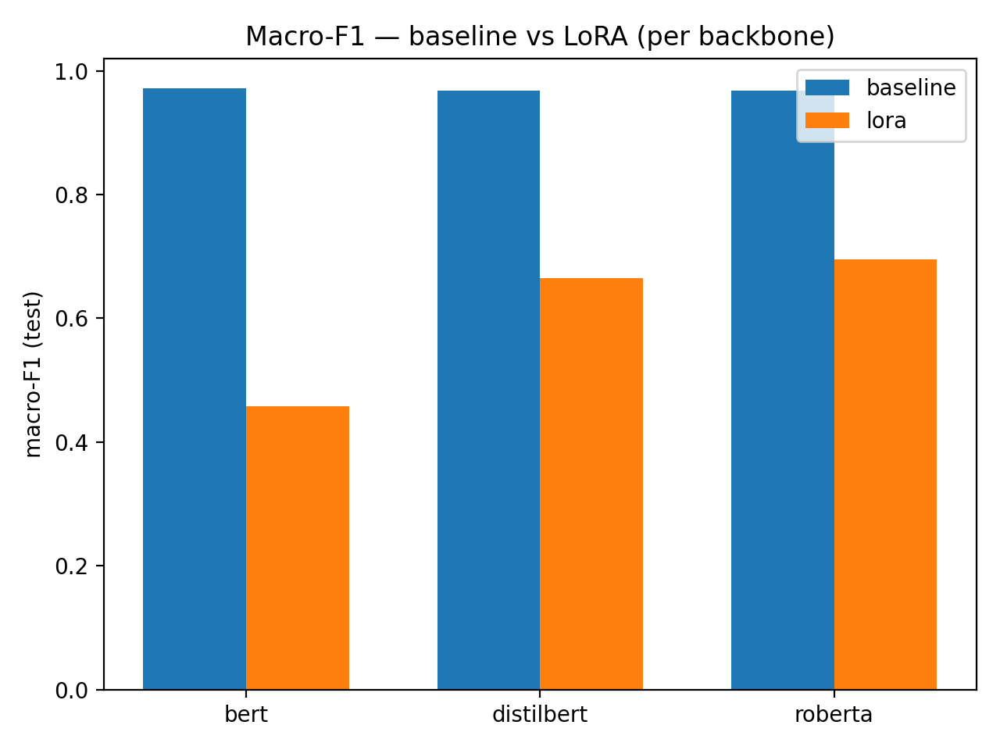
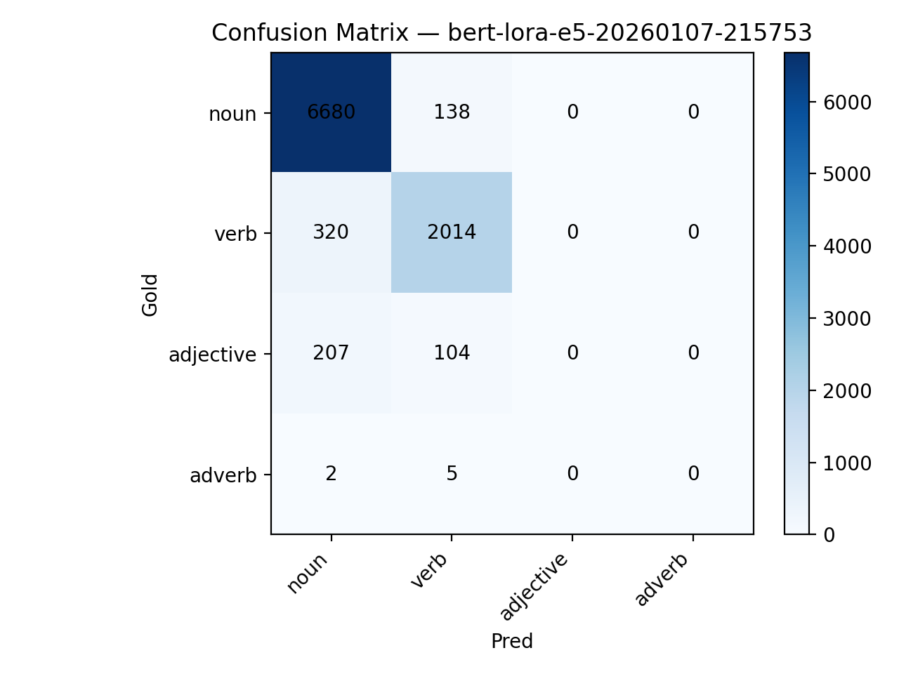
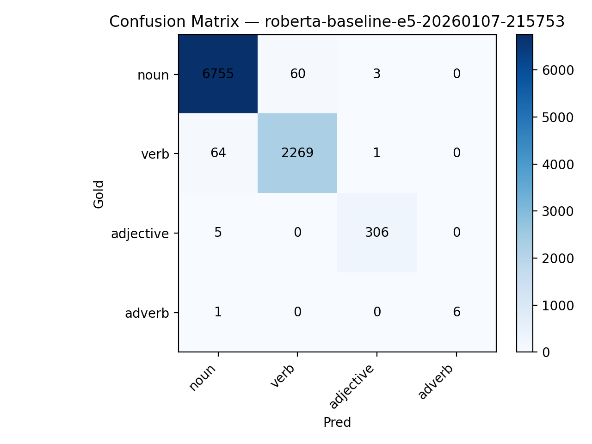
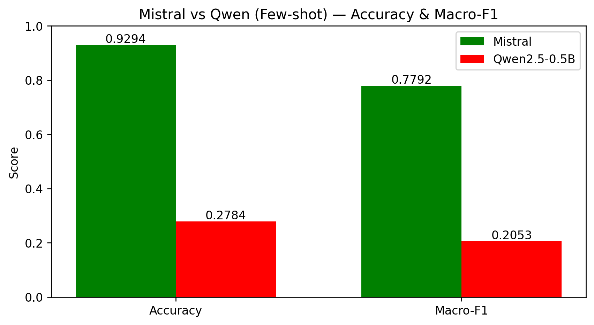
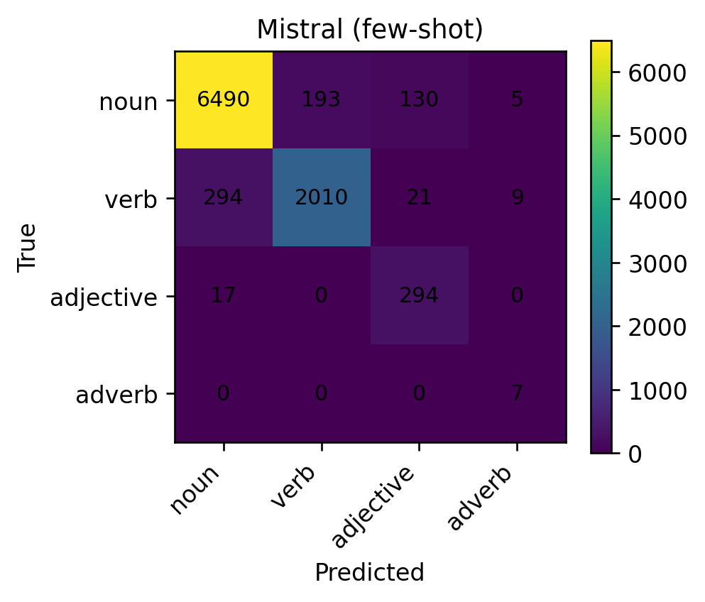
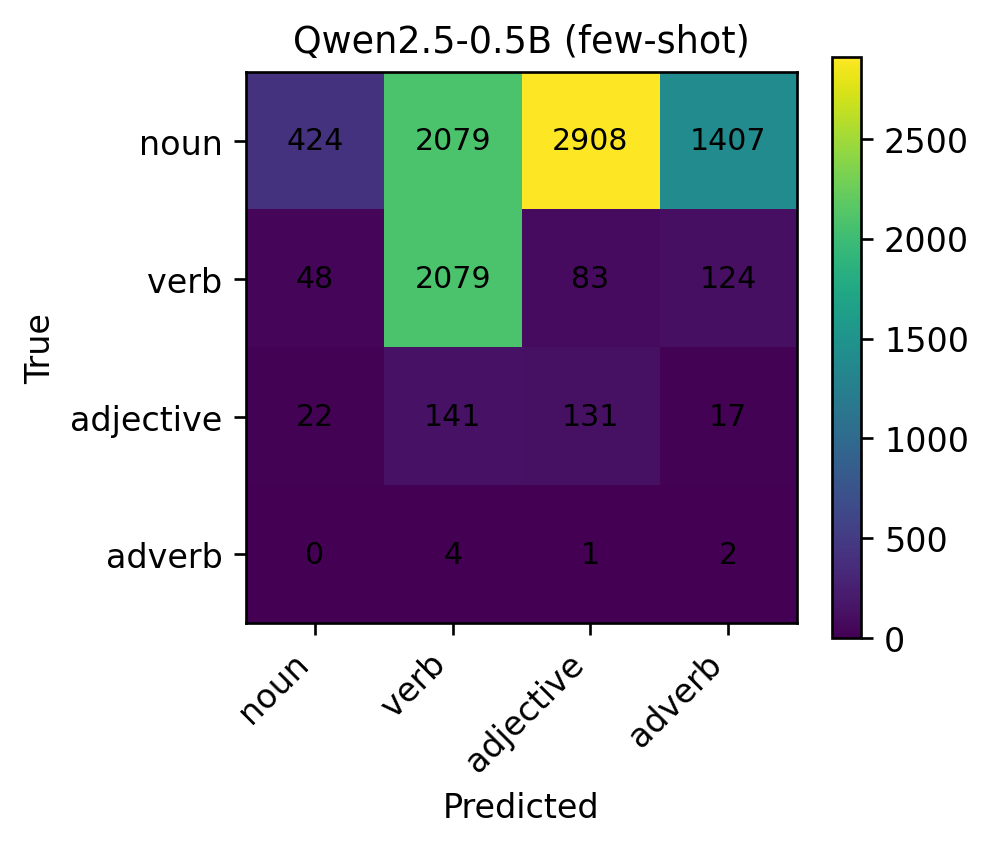

# WordNet Term Typing with Encoders, LoRA and Few-Shot LLMs

This project studies the **Term Typing task (Task A.1 – WordNet)** from the LLMs4OL framework.
The objective is to predict the **generalized lexical type** of a term using encoder-based models
and few-shot Large Language Models (LLMs).

We explore and compare two complementary paradigms:

1. **Encoder-based models**
   - BERT, RoBERTa, DistilBERT
   - Full fine-tuning (baseline)
   - Parameter-efficient fine-tuning with **LoRA**
2. **Few-shot prompting with LLMs**
   - Mistral
   - Qwen (local small language model)

The focus of this work is on **performance vs computational cost trade-offs**
and on clean, reproducible experimental comparisons.

---

## Task Definition

The task corresponds to **WordNet SubTask A.1 (Term Typing)**.

Given:
- a lexical term **L**
- an optional context sentence **S**

the goal is to predict the semantic type **T**, where:

$$
T \in \{\text{noun},\ \text{verb},\ \text{adjective},\ \text{adverb}\}.
$$

---

## Mathematical Formulation

We model Term Typing as a classification function:

$$
f_{\theta}(S, L) \rightarrow T
$$

where:
- **L** is a lexical term  
- **S** is an optional context sentence  
- **T** is the predicted semantic type  
- **fθ** denotes a parameterized model  

---

### Encoder-Based Models

For encoder-based approaches, the input pair (S, L) is converted to a textual sequence **x**
and passed through an encoder.

The encoder output is mapped to a distribution over types, and the predicted type is obtained
by selecting the most likely label.

Training is performed by minimizing cross-entropy loss on labeled examples.
We compare:
- **full fine-tuning** (baseline)
- **LoRA** parameter-efficient fine-tuning

---

### Few-Shot LLM Formulation

In the few-shot setting, model parameters are not updated. A prompt **P** is built from a small labeled set.
Given a new input (S, L), the LLM predicts a type constrained to belong to the predefined set.

---

## Results

### Encoder-Based Models (fine-tuning vs LoRA)

| Backbone     | Mode     | Train Time (s) | Max VRAM (MB) | Trainable (%) | Accuracy | Macro-F1 |
|--------------|----------|----------------|---------------|---------------|----------|----------|
| BERT         | Baseline | 718.52         | 2139.50       | 100.00        | 0.9885   | 0.9716   |
| BERT         | LoRA     | 411.30         | 1105.31       | 0.27          | 0.9181   | 0.4573   |
| DistilBERT   | Baseline | 473.77         | 1226.54       | 100.00        | 0.9862   | 0.9679   |
| DistilBERT   | LoRA     | 240.11         | 611.02        | 1.09          | 0.9381   | 0.6653   |
| RoBERTa      | Baseline | 784.50         | 2345.85       | 100.00        | 0.9859   | 0.9680   |
| RoBERTa      | LoRA     | 402.67         | 1206.70       | 0.71          | 0.9543   | 0.6953   |

#### Macro-F1 by Backbone

<p align="center">
  
</p>

#### Confusion Matrices

<p align="center">
  
  
</p>

<p align="center">
  
  
</p>

<p align="center">
  
  
</p>

---

### Few-Shot LLMs (Mistral vs Qwen)

<p align="center">
  
</p>

<p align="center">
  
  
</p>

---

## Project Structure

```text
configs/                  Training and LoRA configuration files
data/
  ├── raw/                WordNet datasets
  └── processed/          Optional processed data
src/term_typing/
  ├── train.py            Encoder training (baseline / LoRA)
  ├── predict.py          Inference
  ├── eval_from_id.py     Evaluation and confusion matrices
  ├── make_plots.py       Comparative plots
  └── run_sweep.py        Full experimental sweep
fewshot_llms/
  ├── few-shot_mistral.py
  ├── few-shot_llama.py
  ├── few-shot_deepseek.py
  └── few-shot_sml.py
outputs_encoder/
  └── report_images/      Encoder figures (PNG/SVG)
output_llms/
  └── report_images_llms/ LLM figures (PNG/SVG)
